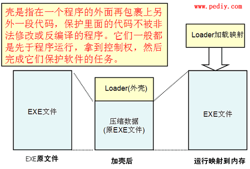

<!--
_class: lead gaia
_paginate: false
-->

# 脱壳篇

---

<!-- backgroundColor: white -->

# 什么是壳



---


# 壳的用途

- 增大逆向难度，有效防止静态分析
- 常用于病毒和木马，隐藏特征码
- 可分为：压缩壳、加密壳、虚拟机

---

# 加载过程

- **保存入口参数**
- 获取需要的API地址
- 还原文件
- **跳转到原入口点（OEP）**

---

# 脱壳

- 脱壳机自动脱壳（UPX等常见壳）
- 手动脱壳（寻找OEP）

---

# 查壳工具

- exeinfo
- Detect It Easy
- 等等

---

# 自动脱壳

工具使用，例：

```shell
upx -d filename
```

---

# 手动脱壳

- 单步调试法
- 堆栈平衡法 

---

<!--
backgroundColor: 
_class: lead gaia
_paginate: false
-->

# 花指令篇

---

<!-- backgroundColor: white -->

# 什么是花指令

- 在真实代码中插入一些垃圾代码的同时还保证原有程序的正确执行
- 使反汇编结果出错

---

# 花指令类型

1. 可执行式
2. 不可执行式

---

## 可执行式

UNCTF RE2

---

## 不可执行式

> 一个必然会发生的跳转

```assembly
  xor eax, eax
  jz LABEL
  (junk data)
LABEL:
  ...
```

```assembly
  jz LABEL
  jnz LABEL
  (junk data)
LABEL:
```

---

From MRCTF2020

```assembly
  call sub9
  _emit 0xE8
  jmp label9
sub9:
  add dword ptr[esp],1
  retn
label9:
```

